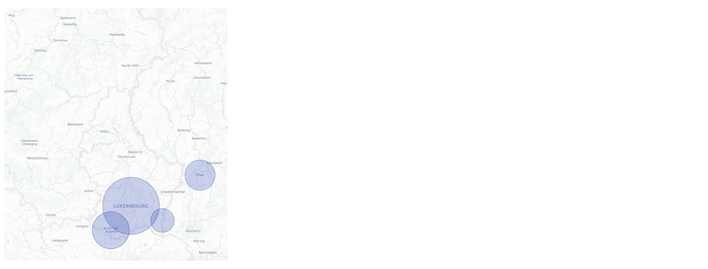
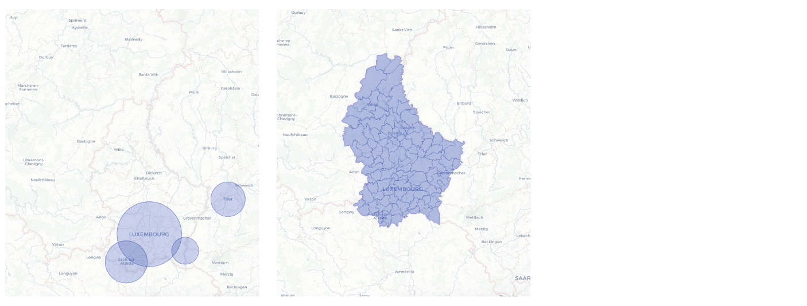
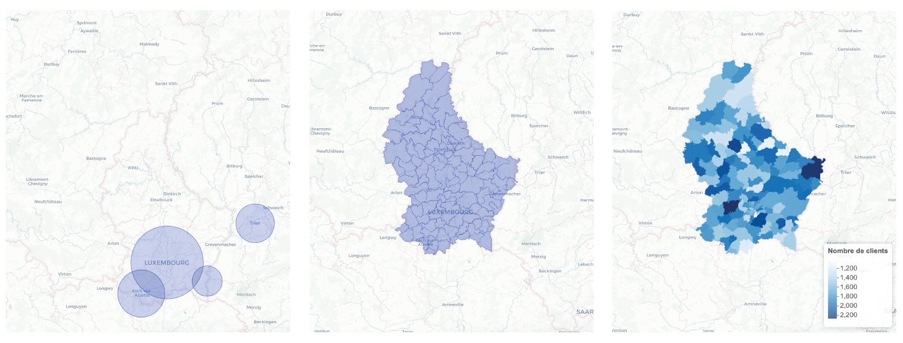

## R & Vador<br/> 
<sub_title1> <span style="color:red;">{`leaflet`}</span> <br>pour contrôler le monde </sub_title1> 

## A Quoi Sert <span style="color:red;">{`leaflet`}</span>?

> *   Faire des cartes  <br> <!-- C'est à dire lorsqu'on veut... -->
> *    &nbsp; &nbsp; &nbsp; Espaces geographiques <br> 
> *    &nbsp; &nbsp; &nbsp; Caracteristiques liés aux espaces <br>
<br>

<!--
> * R vous permet de faire du <span style="color:#bca480;">webscraping</span>  <br>
-->

## 3 Types de Cartes {data-transition="none-out"}


<ul>
<li class="visible " ><span style="color:white">Ajouter des marqueurs sur des lieux</span></li>
<li class="visible " ><span style="color:white">Délimiter des zones geographiques</span></li>
<li class="visible " ><span style="color:white">Ajouter des carateriques sur une zone geographique</span></li>
</ul>


## 3 Types de Cartes {data-transition="none-out"}


<ul>
<li class="visible " >Ajouter des marqueurs sur des lieux</li>
<li class="visible " ><span style="color:white">Délimiter des zones geographiques</span></li>
<li class="visible " ><span style="color:white">Ajouter des carateriques sur des zones geographiques</span></li>
</ul>

## 3 Types de Cartes {data-transition="none-out"}


<ul>
<li class="visible " >Ajouter des marqueurs sur des lieux</li>
<li class="visible " >Délimiter des zones geographiques</li>
<li class="visible " ><span style="color:white">Ajouter des carateriques sur des zones geographiques</span></li>
</ul>

## 3 Types de Cartes {data-transition="none-out"}


<ul>
<li class="visible " >Ajouter des marqueurs sur des lieux</li>
<li class="visible " >Délimiter des zones geographiques</li>
<li class="visible " >Ajouter des carateriques sur des zones geographiques</li>
</ul>


## <span style="color:black;">Les Marqueurs</span>{data-background=#eaf3f9}

## Syntaxe 

> * `leaflet(`<span style="color:#36824d;">`df`</span>`) %>%`<br>
> *  &nbsp; &nbsp; `addTiles() %>%`<br>
> *  &nbsp; &nbsp; `addCircles(lng =` <span style="color:#36824d;">`~Long`</span>`, lat =` <span style="color:#36824d;">`~Lat`</span>`, ` <span style="color:#36824d;">`...`</span>`)`<br>
<br><br>


> * Lire <span style="color:#36824d;">`~Long`</span> comme <span style="color:#bfa4a2;">`df$Long`</span><br> et <span style="color:#36824d;">`~Lat`</span> comme <span style="color:#bfa4a2;">`df$Lat`</span>


## {}

```{r, warning=FALSE, message=FALSE, echo=FALSE}
library(dplyr)
library(leaflet)

cities <- read.csv(textConnection("
City,Lat,Long,Pop
Luxembourg,49.611010,6.130870,23000
Trier,49.758487,6.645416,6570
Liege,50.629960,5.584612,3221
Bruxelles,50.833535,4.361996,5871
Esch-Sur-Alzette,49.494211,5.980375,9870
Remisch,49.541213,6.365443,3902
"))


cities <- cities %>% 
  mutate(tooltip = paste0('<b>Ville : </b>',City,
                          '<br><b>Clients : </b>',
                          formatC(Pop, big.mark = " ")))

leaflet(cities) %>% addTiles() %>%
  addCircles(lng = ~Long, lat = ~Lat, 
             weight = 1, radius = ~sqrt(Pop) *100, 
             popup = ~tooltip,
             popupOptions = list(closeButton = FALSE)
             ) %>% 
  addProviderTiles(providers$CartoDB.Positron)
```

## Code associé

```{r, warning=FALSE, message=FALSE, eval=FALSE}
library(dplyr)
library(leaflet)

# Creation du dataset
cities <- read.csv(textConnection("
City,Lat,Long,Pop
Luxembourg,49.611010,6.130870,23000
Trier,49.758487,6.645416,6570
Liege,50.629960,5.584612,3221
Bruxelles,50.833535,4.361996,5871
Esch-Sur-Alzette,49.494211,5.980375,9870
Remisch,49.541213,6.365443,3902
"))

# Ajout de l'info dans le popup
cities <- cities %>% 
  mutate(info = paste0('<b>Ville : </b>',City,
                          '<br><b>Clients : </b>',
                          formatC(Pop, big.mark = " ")))

# Creation carte
leaflet(cities) %>% addTiles() %>%
  addCircles(lng = ~Long, lat = ~Lat, 
             weight = 1, radius = ~sqrt(Pop) *100, 
             popup = ~info)
```


## <span style="color:black;">Délimitation Geographiques </span>{data-background=#eaf3f9}

## Syntaxe 

> * `leaflet(`<span style="color:#36824d;">`polygon`</span>`) %>%`<br>
> *  &nbsp; &nbsp; `addTiles() %>%`<br>
> *  &nbsp; &nbsp; `addPolygons(` <span style="color:#36824d;">`...`</span>`)`<br>
<br><br>


## {}

```{r, warning=FALSE, message=FALSE, verbatim=FALSE, echo=FALSE}
library(rgdal)
library(sf)
communes <- st_read(dsn ="www/LIMADM_COMMUNES.shp", crs = 2169,  quiet =TRUE)
sp.communes <- st_transform(communes, "+proj=longlat +ellps=WGS84 +datum=WGS84 +no_defs")

leaflet(sp.communes) %>% 
  addTiles() %>%
  addPolygons( stroke = TRUE, weight = 0.5, 
               opacity = 0.5, fillOpacity = 0.3,
               highlightOptions = highlightOptions(color = "white", 
                                                   weight = 0, bringToFront = TRUE)) %>% 
  addProviderTiles(providers$CartoDB.Positron)
  
```

## Code associé

```{r, warning=FALSE, message=FALSE, eval=FALSE}
library(rgdal)
library(sf)

# Lecture shp file
communes <- sf::st_read(dsn ="www/LIMADM_COMMUNES.shp", crs = 2169)

# Transformation en polygon
polygon <- st_transform(communes, "+proj=longlat +ellps=WGS84 +datum=WGS84 +no_defs")

# Creation carte
leaflet(polygon) %>% 
  addTiles() %>%
  addPolygons( stroke = TRUE, weight = 0.5, 
    opacity = 0.5, fillOpacity = 0.3,
    highlightOptions = highlightOptions(color = "white", 
                                        weight = 0, 
                                        bringToFront = TRUE)) 
  
```


## <span style="color:black;">Caractéristiques Geographiques </span>{data-background=#eaf3f9}


## Syntaxe 

> * `df_polygon <- broom::tidy(`<span style="color:#36824d;">`polygon`</span>`)`
> * `pal <- colorNumeric(`<span style="color:#36824d;">"`Blues`"</span>`, NULL)`<br><br>

> * `leaflet(`<span style="color:#36824d;">`df_polygon`</span>`) %>%`<br>
> *  &nbsp; &nbsp; `addTiles() %>%`<br>
> *  &nbsp; &nbsp; `addPolygons(fillColor = `<span style="color:#36824d;">`~pal(pop)`</span>`,`
<br> &nbsp; &nbsp; &nbsp; &nbsp; &nbsp; &nbsp; &nbsp; &nbsp; &nbsp; 
     &nbsp; &nbsp; &nbsp; &nbsp; &nbsp; &nbsp; &nbsp; &nbsp; &nbsp;
     &nbsp; &nbsp; &nbsp; &nbsp; `label = `<span style="color:#36824d;"> `~labels`</span>`, ` <span style="color:#36824d;">`...`</span>`) %>%`<br>
> *  &nbsp; &nbsp; `addLegend(pal = `<span style="color:#36824d;">`pal`</span>`, values = `<span style="color:#36824d;"> `~pop`</span>`, ` <span style="color:#36824d;">`...`</span>`)`
<br><br>


## 

```{r, warning=FALSE, message=FALSE, echo=FALSE}
library(stringr)
communes_df <- geojsonio::geojson_read("www/communes4326.geojson", what = "sp") %>% 
  broom::tidy(.x, region = "COMMUNE")

quartiers <- geojsonio::geojson_read("www/quartiers_lux.json", what = "sp")
quartiers_df <- broom::tidy(quartiers, region = "name") %>% 
  mutate(group=ifelse(str_detect(group,'onnevoie'), 'Bonnevoie.1', group),
         id=ifelse(str_detect(id,'onnevoie'), 'Bonnevoie', id))


communes_df <- communes_df %>% 
  filter(tolower(id)!='luxembourg') %>% 
  rbind(quartiers_df) %>% 
  mutate_at(c(1,2), ~round(.,5)) %>% 
  unique() %>% 
  mutate(id=ifelse(id=="Neudorf/Weimershof /","Neudorf/Weimershof",id),
         group=ifelse(group=="Neudorf/Weimershof /.1","Neudorf/Weimershof.1", group))

# Transformation 
polys <- communes_df %>%
  st_as_sf(coords = c("long", "lat")) %>%
  group_by(id) %>%
  summarise(geometry = st_combine(geometry)) %>%
  st_cast("POLYGON") %>% 
  mutate(pop = abs(round(rnorm(124,1700,245))))

pal <- colorNumeric("Blues", NULL)

labels <- paste0("<b>",polys$id, "</b><br>nb clients: ", formatC(polys$pop, big.mark = " ")) %>% 
  lapply(htmltools::HTML)

leaflet(polys) %>% 
  addTiles() %>%
  addPolygons(stroke = FALSE, smoothFactor = 0.3, fillOpacity = 1,
              fillColor = ~pal(pop),
              label = ~labels ) %>% 
  addLegend(pal = pal, values = ~pop, opacity = 0.7, 
            title = 'Nombre de clients', position = "bottomright") %>% 
  addProviderTiles(providers$CartoDB.Positron)
  
```

## Code associé
```{r, warning=FALSE, message=FALSE,  eval=FALSE}
# Deja fait
# communes <- rgdal::readOGR("/LIMADM_COMMUNES.shp")
# sp.communes <- spTransform(communes, "+proj=longlat +ellps=WGS84 +datum=WGS84 +no_defs")

# Conversion en dataset
df_polygon <-  geojsonio::geojson_read("www/communes4326.geojson", what = "sp") %>% 
  broom::tidy(.x, region = "COMMUNE")


# Transformation
df_polygon %<>%
  st_as_sf(coords = c("long", "lat")) %>%
  group_by(id) %>%
  summarise(geometry = st_combine(geometry)) %>%
  st_cast("POLYGON") %>% 
  mutate(pop = abs(round(rnorm(124,1700,245))))

# Echelle de couleur
pal <- colorNumeric("Blues", NULL)

# Definir les labels
labels <- paste0("<b>",df_polygon$id, "</b><br>nb clients: ", 
                 formatC(df_polygon$pop, big.mark = " ")) %>% 
  lapply(htmltools::HTML)

# Faire le graphique
leaflet(df_polygon) %>% 
  addTiles() %>%
  addPolygons(stroke = FALSE, smoothFactor = 0.3, fillOpacity = 1,
              fillColor = ~pal(pop),
              label = ~labels ) %>% 
  addLegend(pal = pal, values = ~pop, opacity = 0.7, 
            title = 'Nombre de clients', position = "bottomright") 
```

## <span style="color:black;">Pour aller plus loin </span>{data-background=#eaf3f9}

> * Modifier le tooltip

## Nombre de biens disponibles par commune

```{r, warning=FALSE, message=FALSE, echo=FALSE}
  # library(leaflet)
  library(htmlwidgets)
  library(htmltools)
  library(highcharter)
  
df_map <- readr::read_rds('www/df_polygone.rds') %>% 
  filter(count>0)


  pal <- colorNumeric(
    palette = "YlOrRd",
    domain = df_map$count)
  
  as.character.htmlwidget <- function(x, ...) {
    htmltools::HTML(
      htmltools:::as.character.shiny.tag.list(
        htmlwidgets:::as.tags.htmlwidget(
          x
        ),
        ...
      )
    )
  }
  
  
  add_deps <- function(dtbl, name, pkg = name) {
    tagList(
      dtbl,
      htmlwidgets::getDependency(name, pkg)
    )
  }
  
  
leaflet(df_map) %>% 
    addTiles() %>%
    addPolygons(fillColor = ~pal(count), stroke = TRUE, weight = 0, group = ~type_annonce, layerId = ~paste0(id,'#',type_annonce),
                color = ~pal(count),
                # weight = 1, smoothFactor = 0.5,
                opacity = 0.5, fillOpacity = 0.5,
                # label = lapply(df_map$hover, htmltools::HTML),
                popup = df_map$hover,
                highlightOptions = highlightOptions(color = "white", 
                                                    weight = 0, bringToFront = TRUE)
    ) %>% addProviderTiles(providers$CartoDB.Positron) %>%
    addLayersControl(baseGroups = unique(df_map$type_annonce),
                     options = layersControlOptions(collapsed = FALSE)) %>%
    htmlwidgets::onRender(
      # this.on('tooltipopen', function() {HTMLWidgets.staticRender();})
      "
           function(el,x) {
             this.on('popupopen', function() {HTMLWidgets.staticRender();})
           }
            ") %>%
    add_deps("highchart", 'highcharter') %>%
    browsable()  
```


## Source
> * [Carte du luxembourg](https://data.public.lu/en/datasets/limites-administratives-du-grand-duche-de-luxembourg/)
> * [Tutoriel {`leaflet`}](https://rstudio.github.io/leaflet/)

## <span style="color:white;">Récapitulatif </span>{data-background=#7ac58c}
<!-- -->


## <span style="color:white;"><span style="color:#779cb7;">{`leaflet`}</span></span> {data-background=#7ac58c}
 
> * <span style="color:white;"> Ajouter facilement des marqueurs </span>
> * <span style="color:white;"> Faire des cartes de bonnes qualités</span> </span>
> * <span style="color:white;"> tooltips/pop-ups très personnalisables</span>


<!--  
read_html(url) %>% 
    html_nodes('.center+ td a') %>% 
    html_attr('href')
> * Code plus court
> * Excecution rapide 
-->


## {data-background=#00bdf2} 
<span style="color:white;">Merci pour votre attention </span>

## <span style="color:white;">Questions? </span>{data-background=#00bdf2}

<!--

-->


