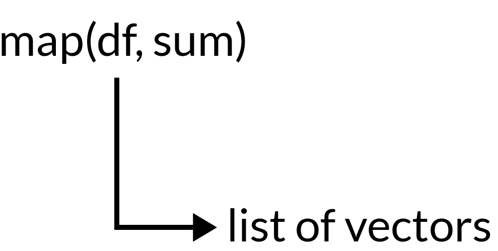
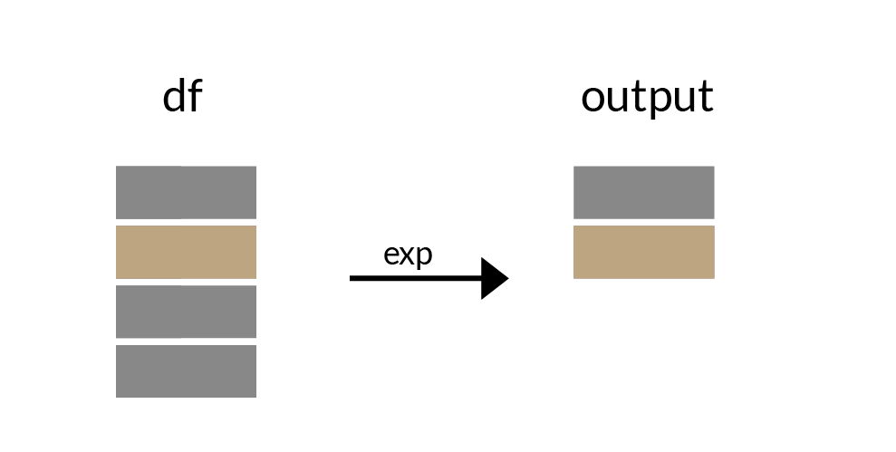

## R & Vador<br/> 
<sub_title1> La force <span style="color:red;">{purrr}</span>
</sub_title1> 

## Contexte 
> * <span style="color:red;">{purrr}</span> est un package faisant partie de <span style="color:#bca480;">{tidyverse}</span><br> 
> * Permet de faire de la <span style="color:#bca480;">Programmation fonctionnelle</span><br>
> * Fonction qui utilise en argument une autre fonction

## <span style="color:black;">Exemple</span>{data-background=#eaf3f9}

## Connaitre la répartition totale des avoirs des clients par type d'encours

## Répartition des avoirs des clients

```{r warning=FALSE, message=FALSE, echo=FALSE}
library(tidyverse)
n <- 7000

id_client <- sample(1:5000, n, replace = TRUE)  
credit <- rweibull(n, 1, 10^7)
# gestion_discret <- rweibull(n, 1, 10^7)
action <- rweibull(n, 1, 10^7)
cash <- rweibull(n, 1, 10^7)
autre <- rweibull(n, 1, 10^7)

info_pf <- tibble(id_client, credit, #gestion_discret, 
                  action, cash, autre) %>%
  mutate(type_client=sample(c('Personal Banking', 'Private Banking', 'CFG'), n, replace=TRUE),
         year = sample(2015:2019, n, replace=TRUE)#,
         # gestion_discret = case_when(
         #   segment=="Personal Banking" ~ (gestion_discret - rweibull(1, 1, 10^(5.5)))/10,
         #   segment=="Privale Banking" ~ (gestion_discret - rweibull(1, 1, 10^(3.5)))/10000,
         #   TRUE ~ gestion_discret),
         # gestion_discret = case_when(
         #   segment=="Personal Banking" & gestion_discret > 100000 ~ (gestion_discret-100000)/10,
         #   gestion_discret < 0 ~ 0,
         #   segment=="Personal Banking" & gestion_discret > 1000000 ~  (gestion_discret-1000000)/100,
         #   TRUE ~ gestion_discret)
         ) %>% 
  filter( type_client!='CFG' | 
            (type_client=='CFG' & #gestion_discret>1000000 & 
               #gestion_discret< 20000000 & 
               id_client<2000
             )
          )%>% 
  group_by(id_client, year) %>% 
  filter(row_number()==1) %>% 
  ungroup

```

```{r warning=FALSE, message=FALSE}
str(info_pf)
```

> * Dataset avec 4 type d'encours de 2015 à 2019
> * crédit, cash, action et autre


## {}
On veut connaitre le montant total<br>par classe d'actif en 2019

## Filtre les données sur 2019
```{r warning=FALSE, message=FALSE}

pf2019 <- info_pf %>% 
  filter(year==2019)

```


## Boucle 
```{r}
n <- 4
actifs <- c("credit", "action", "cash", "autre")

# Creation Matrice resultat
loop_res <- matrix(nrow=0, ncol=n, 
                   dimnames = list(NULL, actifs))

# Creation boucle
for(actif in actifs){
  loop_res[actif] <- sum(pf2019[actif]) 
}

loop_res

```


## Programmation Fonctionnelle 
```{r}
# Les etapes creation matrice resultat & boucle
# se font au meme niveau
fp_res <-  pf2019 %>% 
  select(c("credit", "action", "cash","autre")) %>% 
  map_df(sum)

fp_res

```

## Le même résultat

> * Mais la programmation fonctionnelle est plus direct
> * Voyons la logique qui s'y applique

## Fonctionnement de `map` {data-transition="none-out"}
<br> <br>


## Fonctionnement de `map` {data-transition="none-out"}
<br> <br>


## Fonctionnement de `map` {data-transition="none"}
<br> <br>


## Fonctionnement de `map` {data-transition="none"}
<br> <br>


## <span style="color:black;">Illustration</span>{data-background=#eaf3f9}


## Avec plusieurs colonnes {data-transition="none-in"}
`map(df, sum)` <br>


## Avec plusieurs colonnes {data-transition="none"}
`map(df, sum)` <br>


## Avec plusieurs colonnes  {data-transition="none"}
`map(df, sum)` <br>


## Avec plusieurs colonnes  {data-transition="none"}
`map(df, sum)` <br>


## Avec plusieurs colonnes  {data-transition="none"}
`map(df, sum)` <br>


## Avec plusieurs colonnes  {data-transition="none"}
`map(df, sum)` <br>


## Avec plusieurs colonnes {data-transition="none"}
`map(df, sum)` <br>


## Avec une colonne {data-transition="none-in"}
`map(df, exp)` <br>


## Avec une colonne {data-transition="none-in"}
`map(df, exp)` <br>


## Avec une colonne {data-transition="none"}
`map(df, exp)` <br>


## Avec une colonne {data-transition="none"}
`map(df, exp)` <br>


## Avec une colonne {data-transition="none"}
`map(df, exp)` <br>


## Avec une colonne {data-transition="none"}
`map(df, exp)` <br>


## Famille `map()`

> * <span style="color:#bca480;">`map`     </span> retourne une liste
> * <span style="color:#bca480;">`map_df`  </span> retourne un dataframe
> * <span style="color:#bca480;">`map_int` </span> retourne vecteur integer
> * <span style="color:#bca480;">`map_chr` </span> retourne vecteur caractere
> * <span style="color:#bca480;">`map2` </span> va prendre 2 arguments <span style="color:#779cb7;">(x, y, function)</span> 
> * <span style="color:#bca480;">`pmap` </span> va prendre p arguments <span style="color:#779cb7;">(list, function)</span> 

## `walk()`

> * Même principe que `map()` -> <span style="color:#779cb7;">(x, function) </span>
> * Retourne aucun objet
> * Parfait pour sauvegarder ou afficher des éléments


## <span style="color:black;">Cas Pratique</span>{data-background=#eaf3f9}

## <span style="color:black;"> </span>{data-background=#eaf3f9}

Automatiser la création de graphique par type de clients<br>et les insérer dans un PowerPoint


## Regroupe les données par rapport au type de clients
```{r, warning=FALSE, message=FALSE}
pf <- info_pf %>% 
  select(id_client, cash, type_client, year) %>% 
  group_by(type_client, year) %>% 
  summarise(cash= round(sum(cash)/1000000,2)) %>% 
  nest()

pf
```


## Utilisation de <span style="color:#bca480;">`map()`</span>
```{r, warning=FALSE, message=FALSE, results=FALSE}
pf1 <- pf %>% 
  mutate(plots = map( data, function(x){ggplot(x) + 
                     geom_bar(aes(year, cash), stat='identity') +
                      ggtitle('Montant total en gestion discrétion') +
                     ylab("Montant en millions d'euros") + #ylab("Montant (millions de dollars)")
                     xlab("Année") +
                     theme_bw() +
                     theme(plot.title = element_text(lineheight = 1.1,size = 20,  hjust = 0.5),
                           plot.subtitle = element_text(lineheight = 1.1,  hjust = 0.5),
                           panel.grid.minor = element_blank(),
                           panel.grid.major = element_blank(),
                           panel.border = element_blank(),
                           axis.line.x = element_blank(),
                           legend.position = 'none'
                     )}
                     ))

```


##
```{r, warning=FALSE, message=FALSE, results=FALSE}
pf1$plots[1]
```


## Utilisation de <span style="color:#bca480;">`map2()`</span>
```{r, warning=FALSE, message=FALSE, results=FALSE}
pf2 <- pf %>% 
  mutate(plots = map2( .x=data,.y=type_client, function(x, y){ggplot(x) + 
      geom_bar(aes(year, cash), stat='identity') +
      ggtitle('Montant total en cash', subtitle=y) +
      ylab("Montant en millions d'euros") + #ylab("Montant (millions de dollars)")
      xlab("Année") +
      theme_bw() +
      theme(plot.title = element_text(lineheight = 1.1, size = 20,  hjust = 0.5),
            plot.subtitle = element_text(lineheight = 1.1,  hjust = 0.5),
            panel.grid.minor = element_blank(),
            panel.grid.major = element_blank(),
            panel.border = element_blank(),
            axis.line.x = element_blank(),
            legend.position = 'none'
      )}
  ))

```


##
```{r, warning=FALSE, message=FALSE, results=FALSE}
pf2$plots[1]
```

##
```{r, warning=FALSE, message=FALSE, results=FALSE}
pf2$plots[2]
```


##  Utilisation de <span style="color:#bca480;">`pmap()`</span>
```{r, warning=FALSE, message=FALSE, results=FALSE}
pf3 <- pf %>% 
  ungroup() %>% 
  mutate(fill_color=c('#779cb7', '#36824d', '#bfa4a2'),
         plots = pmap( list(data, type_client, fill_color), function(x, y, z){ggplot(x) + 
      geom_bar(aes(year, cash), stat='identity', fill=z) +
      ggtitle('Montant total en gestion discrétion', subtitle=y) +
      ylab("Montant en millions d'euros") + #ylab("Montant (millions de dollars)")
      xlab("Année") +
      theme_bw() +
      theme(plot.title = element_text(lineheight = 1.1,size = 20,  hjust = 0.5),
            plot.subtitle = element_text(lineheight = 1.1,  hjust = 0.5),
            panel.grid.minor = element_blank(),
            panel.grid.major = element_blank(),
            panel.border = element_blank(),
            axis.line.x = element_blank(),
            legend.position = 'none'
      )}
  ))
```


##
```{r, warning=FALSE, message=FALSE, results=FALSE}
pf3$plots[1]
```

##
```{r, warning=FALSE, message=FALSE, results=FALSE}
pf3$plots[2]
```


## Sauvegarde dans un Powerpoint
```{r, eval=FALSE}
library(rvg)
library(officer)

create_pptx <- function(plot, path){
  
  read_pptx(path) %>%
    add_slide(layout = "Title and Content", master = "Office Theme") %>%
    ph_with(plot, location = ph_location_fullsize() ) %>% 
    print(target = path)
}

walk(tt3$plots, function(x){create_pptx(x, paste0(getwd(),'/test.pptx'))})
```

## Résultat


## Résultat


## <span style="color:white;">Récapitulatif </span>{data-background=#7ac58c}
<!-- -->


## <span style="color:white;">`map()`</span> {data-background=#7ac58c}
 
> * <span style="color:white;"> peut etre utilisé avec %>% </span>
> * <span style="color:white;"> peut retourner differents types d'objets </span>
> * <span style="color:white;"> peut prendre plusieurs arguments </span>

<!--  
> * Code plus court
> * Excecution rapide 
-->


## {data-background=#00bdf2} 
<span style="color:white;">Merci pour votre attention </span>

## <span style="color:white;">Questions? </span>{data-background=#00bdf2}

<!--
## <span style="color:white;"> </span>{data-background=#00bdf2}
> * <span class="fragment fade-out" style="color:white;">Pourquoi utiliser les fonctions de <span style="color:green;">{purrr}</span> si les fonctions de type `apply` font la même chose?</span>
> * <span style="color:white;">Est-ce que `map` fait les calculs en parallele?</span>
-->


