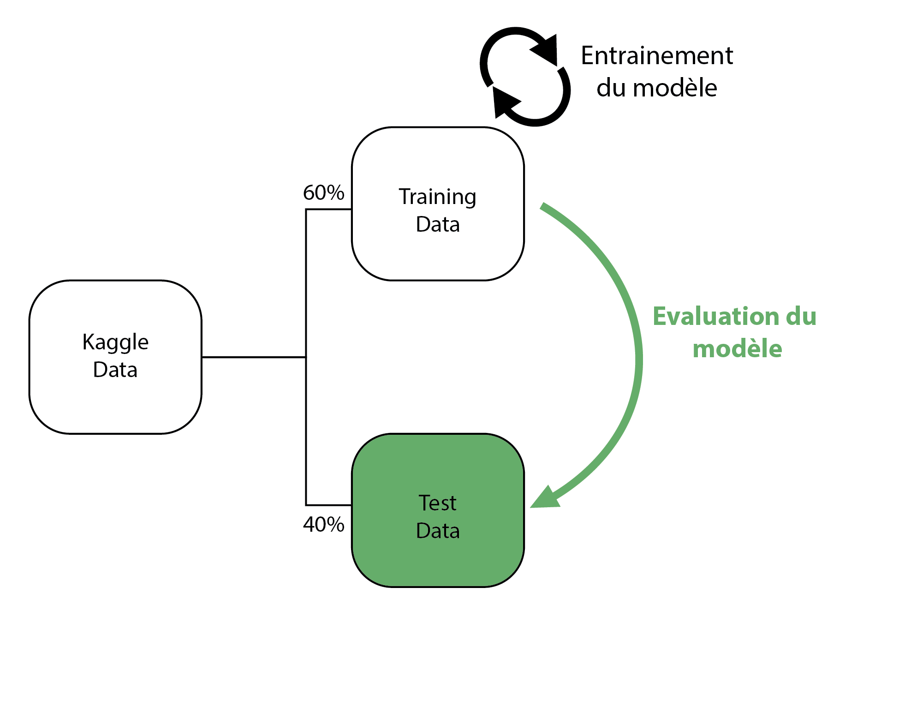

## R & Vador<br/> 
<sub_title1> <span style="color:red;">Donnée Textuelle</span> 
<br>Décoder les plans des rebelles
</sub_title1> 


```{css, echo=FALSE}
pre code, pre, code {
white-space: pre !important;
overflow-x: scroll !important;
overflow-y: scroll !important;
word-break: keep-all !important;
word-wrap: initial !important;
max-height:30vh !important;
}

table {
overflow-x: scroll !important;
overflow-y: scroll !important;
}
.reveal table {
    font-size: 0.4em !important;
}
```


## Contexte 
> * Les données se présentent sous multiples formes<br> 
> * Données structurées: <span style="color:red;">tableur</span> <br>
> * Données semi structurées: <span style="color:red;">json, html</span> <br>
> * Données non structurées: <span style="color:red;">video, photo, pdf</span> <br>

## Contexte 

> * R et Python rendent l'analyse des données <span style="color:red;">semi</span> et <span style="color:red;">non structurées</span> plus facile


## <span style="color:black;">Pourquoi analyser du texte? </span>{data-background=#eaf3f9}


## {data-background=#eaf3f9}

> * Plus de 80% de la totalité des données <br> 
> * Elles permettent de comprendre le "Pourquoi" <br>
> * Offre de nouvelles possibilités (chatGPT)

## <span style="color:black;">Cas Pratique</span>{data-background=#eaf3f9}

## <span style="color:black;"> </span>{data-background=#eaf3f9}

Analysons les tweets de Donald Trump de 2009 à 2016

## Donald Trump, un tweetos très actif
```{r warning=FALSE, message=FALSE, echo=FALSE}
library(tidytext)
library(openxlsx)
library(readr)
library(stringr)
library(lubridate)
library(reactable)
library(DT)
library(purrr)
library(dplyr)
library(highcharter)

tweet <- readRDS("www/tweet_trump_sentiment.rds")
# tweet <- read_csv("www/tweet_trump_sentiment.csv")
sample <- read.xlsx("www/2016_12_05-TrumpTwitterAll.xlsx") %>% 
  mutate(Date = mdy(str_sub(Date,1,10)))

```


```{r warning=FALSE, message=FALSE, echo=FALSE}
nb_tweet <- tweet %>% 
  mutate(month = lubridate::month(Date, label=TRUE),
         year = year(Date),
         quarter = lubridate::quarter(Date, with_year = TRUE)) %>% 
  group_by(month, year) %>% 
  mutate(count=n())%>% 
  arrange(Date) %>% 
  slice(1) %>% 
  mutate(Date= ymd(paste0(str_sub(Date,1,8),'01'))) %>% 
  ungroup() %>% 
  arrange(Date)


hchart(nb_tweet,'line', hcaes(Date,count),
       tooltip = list(pointFormat = paste0("Nb tweets: <b>{point.count}</b>"))) %>% 
  hc_xAxis(type = "datetime", dateTimeLabelFormats = list(day = '%M')) %>% 
  hc_yAxis(title = list(text = '#Tweets')) %>% 
  hc_title(text='Evolution de son nombre de tweet entre 2009 à 2016') %>% 
      hc_plotOptions(line = list(
        marker = list(
          enabled = FALSE
        )))

```

## Dataset

Les données ont le format suivant:
```{r warning=FALSE, message=FALSE}
datatable(head(sample,3),  
          rownames = FALSE, options = list(pageLength = 3, dom = 't') )

```


## {}
Après transformation via<br>des Expressions Régulère **(RegEx)**: 
```{r warning=FALSE, message=FALSE, eval=FALSE}

tidy_tweet <- tweet %>% 
  distinct() %>% 
  mutate(date_time =  ymd_hms(paste(Date, Time)),
         user=str_extract_all(message_punctuationless, '@(\\w){1,15}'),
         is_rt = ifelse( str_detect(message, '^ RT @|^RT @|"@'),1,0),
         rt_user = ifelse(is_rt, str_extract(message, '@(\\w){1,15}'), NA),
         text = ifelse(is_rt & ((str_detect(message,'^"') & str_count(message,'"')==1|str_detect(message,'^RT'))),'', 
                       ifelse(is_rt , str_remove_all(message, '".*"'), message)),
         hashtag = str_extract_all(message, '#(\\w){1,30}')) 


```

## Données nettoyées

```{r warning=FALSE, echo=FALSE, message=FALSE}
datatable(head(tweet %>% select(date_time, message, text_trump, user, rt_user, is_rt, hashtag) %>% 
                 rename(`is RT`=is_rt, `user RT`=rt_user, `written by Trump` = text_trump),150),  rownames = FALSE, options = list(pageLength = 5, dom = 't') )

```


## Analysons la connotation des tweets
>* Méthode 1 : Mot par mot (méthode naïve)
>* Méthode 2 : Par message (Machine Learning)

## Méthode 1
Mot par mot

## Dictionnaire

```{r warning=FALSE, eval=FALSE, message=FALSE}
afinn <- get_sentiments("afinn")

```

```{r warning=FALSE, echo=FALSE, message=FALSE}
afinn <- get_sentiments("afinn")
datatable(head(afinn,50),  rownames = FALSE, options = list(pageLength = 5, dom = 't') )


```

## Jointure avec les tweets

```{r warning=FALSE, eval=FALSE, message=FALSE}
score_bywords <- tweet %>% 
  unnest_tokens(word, text) %>% 
  left_join(afinn, by='word')
```

```{r warning=FALSE, echo=FALSE, message=FALSE}
score_bywords <- tweet %>% 
  unnest_tokens(word, text) %>% 
  inner_join(afinn, by='word') %>% 
  select(date_time, message, word, value) %>% 
  arrange(date_time)

datatable(score_bywords[50:150,],  rownames = FALSE, options = list(pageLength = 5, dom = 't') )

```

## Méthode 2
Natural Language Processing<br>
(Machine Learning)

## Modélisation {data-transition="none-out"}
 <br><br>

## Modélisation {data-transition="none-out"}
 <br><br>

## Modélisation {data-transition="none-out"}
 <br><br>

## Modélisation {data-transition="none-out"}
 <br><br>

## Modélisation {data-transition="none-out"}
 <br><br>

## <span style="color:white;">Résultat </span>{data-background=#7ac58c}

## {}

```{r warning=FALSE, echo= FALSE, message=FALSE}

datatable(head(tweet %>%  select(Date, Time, message, text_trump, hashtag, is_rt, rt_user, is_positive_word, is_positive_nlp) %>%  rename(`is RT`=is_rt, `user RT`=rt_user, `written by Trump` = text_trump, `positive by words`=is_positive_word, `positive by nlp` =is_positive_nlp),50),  rownames = FALSE, width="100%",options = list(pageLength = 5, dom = 't') )

```


## Le plus mentionné n'est pas le plus proche

```{r warning=FALSE, echo= FALSE, message=FALSE}
df_top_user <- tibble(user = unlist(tweet$user)) %>%
  group_by(user) %>% 
  summarise(count = n()) %>% 
  arrange(desc(count)) %>% 
  slice(2:11)

hchart(df_top_user, 'bar', hcaes(x=user, y=count),
       tooltip = list(pointFormat = paste0("Mentionné: <b>{point.count}</b> fois"))) %>%
  hc_xAxis(title = list(text ="User")) %>%
  hc_yAxis(title = list(text = '#Mentions')) %>%
  hc_title(text='Les comptes les plus mentionnés')

```
## <span style="color:#de6263;">FoxNews</span> vs <span style="color:#7cb5ec;">CNN</span>
Les mots les plus utilisés lorsqu'il mentionne les comptes @FoxNews et @CNN 

```{r warning=FALSE, echo= FALSE, message=FALSE}
tweet_cnn <- tweet %>% 
  filter(str_detect(message, '@CNN')) %>% 
  unnest_tokens(word, text) %>%
  anti_join(stop_words) %>% 
  mutate(word=case_when(
    word %in% c('barackobama\'s', 'obama\'s', 'barackobama', 'obama.i') ~ 'obama',
    word %in% c('interviewed') ~ 'interview',
    word %in% c('chris', 'wallace') ~  'chriswallace',
    word=='jobs' ~ 'job',
    TRUE ~ as.character(word))) %>% 
  group_by(word) %>% 
  summarise(count=n()) %>% 
  arrange(desc(count)) %>% 
  filter(!word %in% c('realdonaldtrump','t.co','http','https','wow','trump', 'p.m', 'a.m', '10', '00', '9','cnn')) %>% 
  slice(1:15) %>% 
  mutate(rank= row_number(),
         word=factor(word, level=.$word[rank])) 


tweet_fox <- tweet %>% 
  filter(str_detect(message, '@FoxNews')) %>% 
  unnest_tokens(word, text) %>%
  anti_join(stop_words) %>% 
  mutate(word=case_when(
    word %in% c('barackobama\'s', 'obama\'s', 'barackobama', 'obama.i') ~ 'obama',
    word %in% c('interviewed') ~ 'interview',    
    word %in% c('chris', 'wallace') ~  'chriswallace',
    word=='jobs' ~ 'job',
    TRUE ~ as.character(word))) %>%   
  group_by(word) %>% 
  summarise(count=n()) %>% 
  arrange(desc(count)) %>% 
  filter(!word %in% c('realdonaldtrump','t.co','http','https','trump', 'p.m', 'a.m', '10', '00', 'foxnewssunday',
                      'fox', 'foxnews')) %>% 
  slice(1:15) %>% 
  mutate(rank= row_number(),
         word=factor(word, level=.$word[rank]),
         count2=count,
         count=-count) 


c1 <- hchart(tweet_cnn, 'bar', hcaes(word, count, fill=word), 
             name='Occurence',  tooltip = list(pointFormat = paste0("Utilisé: <b>{point.count}</b> fois"))) %>% hc_xAxis(opposite=TRUE) %>% hc_yAxis(title = list(
  text= ' '),
  labels = list(
    formatter = JS("function () {
                      return Math.abs(this.value) ;
                                    }")), max = 70)
c2 <- hchart(tweet_fox, 'bar', hcaes(word, count, fill=word), color='#de6263',
             name='Occurence',  tooltip = list( pointFormat = paste0("Utilisé: <b>{point.count2}</b> fois"))) %>% hc_yAxis(title = list(
  text= ' '),
  labels = list(
    formatter = JS("function () {
                      return Math.abs(this.value) ;
                                    }")))

lst <- list(
  c2,
  c1
)

hw_grid(lst, ncol = 2)  

```


## Tweets plus positifs quand<br><span style="color:#de6263;">@FoxNews</span> est mentionné

```{r warning=FALSE, echo= FALSE, message=FALSE}
tweet_fox <- tweet %>% 
  filter(str_detect(message, '@FoxNews')  & str_count(text_trump)>0) %>% 
  summarize(count=n(), positive_nlp = sum(is_positive_nlp, na.rm = TRUE), positive_word = sum(is_positive_word, na.rm = TRUE)) %>% 
  mutate(channel='FoxNews')


tweet_cnn <- tweet %>% 
filter(str_detect(message, '@CNN') & str_count(text_trump)>0) %>% 
  summarize(count=n(), positive_nlp = sum(is_positive_nlp, na.rm = TRUE), positive_word = sum(is_positive_word, na.rm = TRUE)) %>% 
  mutate(channel='CNN') 

tweet_channel <- rbind(tweet_fox,tweet_cnn ) %>% 
  mutate(pct = round(positive_nlp/count,2)*100, 
         rank = row_number(),
         channel=factor(channel, level=.$channel[rank]) )

hchart(tweet_channel,'column', hcaes(y=pct, group=channel), color=c('#de6263', '#7bb4ec'),
       tooltip = list(headerFormat = "<b>{point.group}</b>",
                      pointFormat = paste0("% tweets positifs: <b>{point.pct}%</b><br>Nbre tweets: <b>{point.count}</b><br>Nbre tweets positifs: <b>{point.positive_nlp}</b> "))) %>% 
  hc_yAxis(title = list(text = 'pourcentage (%)')) %>% 
  hc_xAxis(labels = list(enabled = FALSE))# %>% 
  #hc_title(text='Tweets plus positifs quand<br>@FoxNews est mentionné')
```


## <span style="color:white;">Récapitulatif </span>{data-background=#7ac58c}
<!-- -->

## <span style="color:white;">Dans cet exemple</span>{data-background=#7ac58c}
> * <span style="color:white;">Les données ont été nettoyées avec</span> <span style="color:#414141;">{stringr}</span>
> * <span style="color:white;">Les données ont été visualisées avec</span> <span style="color:#414141;">{highcharter}</span>

## <span style="color:#424442;">Limite</span> {data-background=#cc00005c}

> * <span style="color:#424442;">L'exemple était volontairement simple</span>
> * <span style="color:#424442;">Le modèle de machine learning n'était pas avancé</span>
> * <span style="color:#424442;">Pour aller plus loin, le Deep Learning est conseillé</span>

## {data-background=#00bdf2} 
<span style="color:white;">Merci pour votre attention </span>

## <span style="color:white;">Questions? </span>{data-background=#00bdf2}

<!--
## <span style="color:white;"> </span>{data-background=#00bdf2}
> * <span class="fragment fade-out" style="color:white;">Quels sont les use <span style="color:green;"> cases classiques</span> où nous avons besoin de manipuler de la données sous forme de texte?</span>
> * <span style="color:white;">Est-ce que le RegEx est nécessaire?</span>

-->


