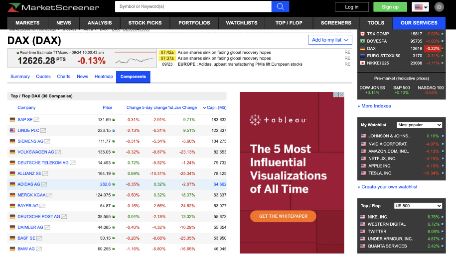
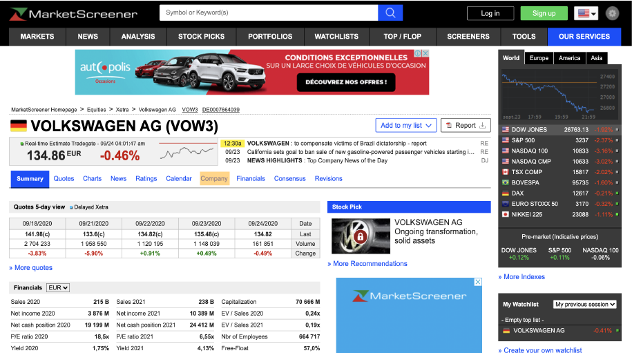
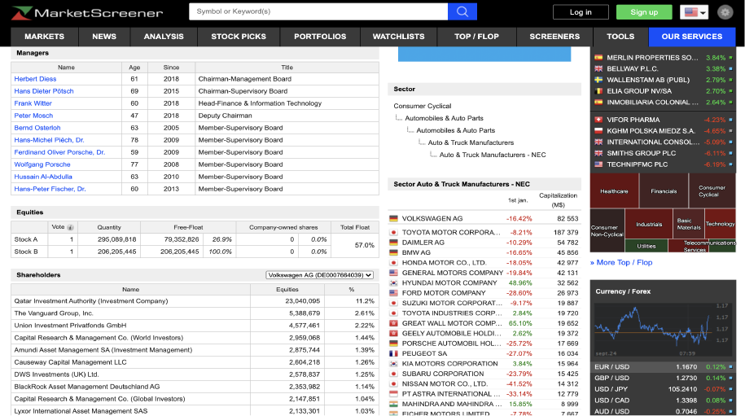
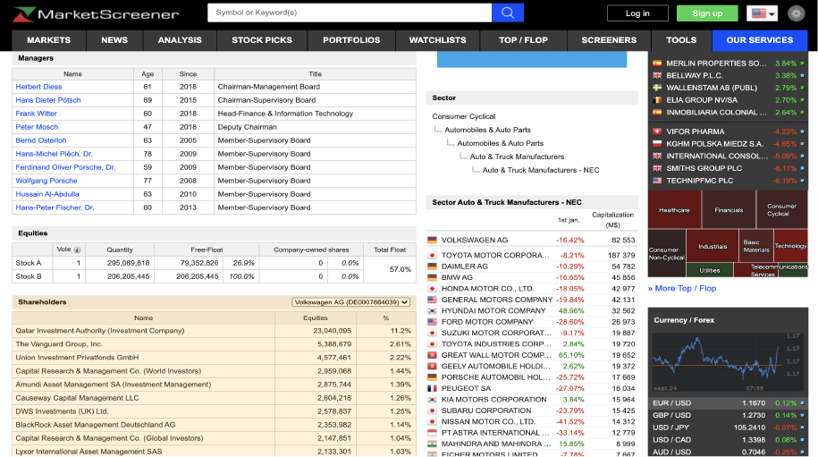
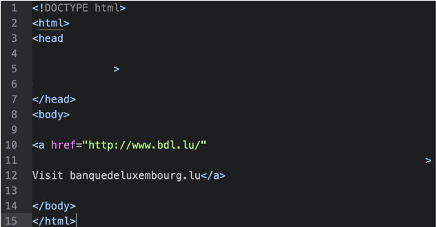
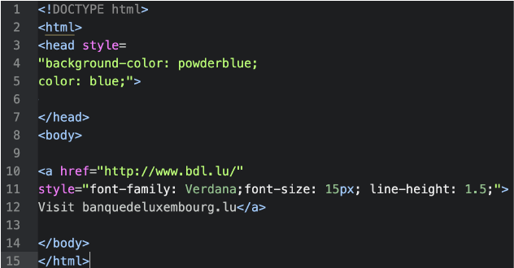
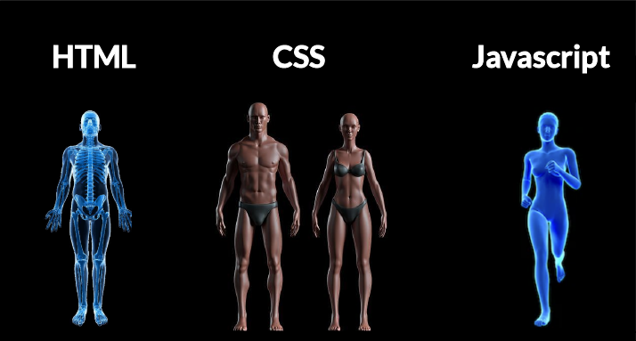
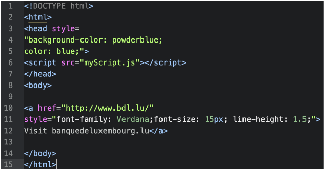

## R & Vador<br/> 
<sub_title1>Libère ta colère<br>Utilise le <span style="color:red;">Web scraping</span><br> 
</sub_title1> 

```{css, echo=FALSE}
pre code, pre, code {
white-space: pre !important;
overflow-x: scroll !important;
overflow-y: scroll !important;
max-height:30vh !important;
}

table {
overflow-x: scroll !important;
overflow-y: scroll !important;
}

```

## Contexte 
> * Récupérer des données sur internet permet  <br>
> *  &nbsp; &nbsp; &nbsp; Garder des historiques<br> 
> *  &nbsp; &nbsp; &nbsp; Enrichir ses analyses<br>
> *  &nbsp; &nbsp; &nbsp; Suivre la concurrence<br>
<br>

<!--
> * R vous permet de faire du <span style="color:#bca480;">webscraping</span>  <br>
-->

## <span style="color:black;">Etude de cas</span>{data-background=#eaf3f9}

## 
<span class="fragment fade-in" style="color:#bca480;">Qui sont les principaux actionnaires<br>du DAX30 (indice boursier allemand)? </span>


## Commençons par une entreprise {data-background=#eaf3f9}

> * Trouver les principaux actionnaires de Volkswagen

## Volkswagen {data-transition="none"}
[marketscreener.com](www.marketscreener.com) > Market > Index > DAX
<br> <br>


## Volkswagen {data-transition="none"}
Choisir Volkswagen 
<br> <br>


## Volkswagen {data-transition="none"}
Cliquer sur <span style="color:orange;">Company</span>
<br> <br>


## Volkswagen {data-transition="none"}
Les détails de l'entreprise
<br> <br>


## Volkswagen {data-transition="none"}
Récupérer le tableau des actionnaires 
<br> <br>



## <span style="color:black;"></span>{data-background=#eaf3f9}
Effectuer cette action pour les 30 entreprises du DAX30

## <span style="color:black;"></span>{data-background=#eaf3f9}
Le <span style="color:red;">Web scraping</span> peut automatiser cette tâche

## <span style="color:black;">Rappel</span>{data-background=#eaf3f9}
Structure des pages web


## {data-transition="none-out"}
<section data-background="#000000" >
<br>

</section>

## {data-transition="none"}
<section data-background="#000000" >
<br>

</section>

## {data-transition="none"}
<section data-background="#000000" >
<br>

</section>

## <span style="color:black;">Utilisation de <span style="color:#779cb7;">{`rvest`}</span></span>{data-background=#eaf3f9}
> * Recherche d'éléments via sélecteur HTML 
> * Recherche d'éléments via sélecteur CSS

## {}
```{r, echo=FALSE, warning=FALSE, message=FALSE}
library(dplyr)
library(stringr)
library(magrittr)
library(readr)
library(DT)

load('www/dax30.RData')
df_holders <- read_csv('www/all_holders.csv')
```

```{r warning=FALSE, message=FALSE,  eval=FALSE}
library(dplyr)
library(stringr)
library(magrittr)
library(rvest)

# Recherche des liens sur la page marketscreener > DAX30
list_component<- read_html('https://www.marketscreener.com/dax30/company/') %>% 
    html_nodes('.center+ td a') %>% 
    html_attr('href')

# Visualisation des 8 premiers liens
head(list_component, 8)

```

```{r warning=FALSE, message=FALSE, echo=FALSE}
head(list_component, 8)

```


## {}

Filtre sur les liens ayant <span style="color:#198585;">`quote/stock/`</span>

```{r warning=FALSE, message=FALSE,  eval=FALSE}

list_component %<>% 
  str_subset('quote/stock/')

```


## Les 3 plus grands actionnaires de LINDE 

```{r warning=FALSE, message=FALSE,  eval=FALSE}
x <- list_component[1]
url <- paste0('https://www.marketscreener.com',x,'company/')
read_page <- read_html(url)

# Extraction du tableau
df_stocks <- read_page %>% 
  html_nodes('table .nfvtTab')  %>% 
  .[5] %>% 
  html_table(fill=TRUE) %>% 
  .[[1]]

# Nettoyer le tableau
df_stocks %>% 
  rename(Name=X1, Equities=X2, Hold=X3) %>% 
  filter(row_number()>1) %>% 
  head(3)
```

```{r warning=FALSE, echo=FALSE, message=FALSE}
demo_df_stock <- df_stocks[[1]] %>% 
  rename(Name=X1, Equities=X2, Hold=X3) %>% 
  filter(row_number()>1) %>% 
  head(3)

datatable(demo_df_stock,  rownames = FALSE, options = list(pageLength = 5, dom = 't') )
```

## <span style="color:black;"></span>{data-background=#eaf3f9}
Répeter le processus pour les 30 valeurs du DAX30

## Création de fonction
```{r warning=FALSE, eval=FALSE, message=FALSE}
extract_holders <- function(x){
  url <- paste0('https://www.marketscreener.com',x,'company/')
  
  # Lecture la page
  read_page <- read_html(url)
  
  # Extraction du tableau
  df_stocks <- read_page %>% 
    html_nodes('table .nfvtTab')  %>% 
    .[5] %>% 
    html_table(fill=TRUE) 
  
  # Nettoyage du tableau
  df_stocks[[1]] %>% 
    rename(Name=X1, Equities=X2, Hold=X3) %>% 
    filter(row_number()>1)
}

```


## Utilisation de la fonction
```{r warning=FALSE, eval=FALSE, message=FALSE}
df_all <- tibble(link = list_component) %>% 
  mutate(holders=map(link, extract_holders))
```

```{r warning=FALSE, echo=FALSE, message=FALSE}
datatable(head(df_all3),  rownames = FALSE, options = list(pageLength = 5, dom = 't') )
```

## <span style="color:black;"> Répondons à la question</span>{data-background=#eaf3f9}
> * <span style="color:#bca480;">Qui sont les principaux actionnaires du DAX30?</span>

## {}

```{r warning=FALSE, echo=FALSE, message=FALSE,  fig.width=12, fig.height=8}

df_all_new <- df_all %>% 
  mutate(montant = str_remove_all(Equities, ',') %>% as.numeric) %>% 
  group_by(Name) %>% 
  summarise(Montant_total=sum(montant)) %>% 
  arrange(desc(Montant_total)) %>% 
  head(10)

library(ggplot2)
library(ggtext)

ggplot(df_all_new, 
       aes(x=reorder(Name, Montant_total), y=Montant_total)) +
  geom_bar( stat='identity', fill= c('#6891d0',rep('#b2b4b7',9))) +
  geom_text(aes(label=paste(format(round(Montant_total/10^6,0),big.mark=" ", big.interval=3L),' '), 
                y=(Montant_total-8*10^7)), # color=c( '#b2b4b7','#6891d0'),
            fontface = "bold", color = "#ffffff")  +
  coord_flip() +
  ggtitle('Le gouvernement allemand soutient ses leaders',
          subtitle = '<br>La participation du gouvernement allemand est <b style="color:#6891d0">3 fois plus élevée</b> <br>que celle du second actionnaire, The Vanguard Group<br>') +
  ylab("Participation au capital des valeurs du DAX30 (en millions d'euros)") + 
  #ylab("Montant (millions de dollars)")
  xlab(" ") +
  labs(caption = "source: www.marketscreener.com")+
  theme_bw() +
  theme(plot.title = element_text(lineheight = 1.1,size = 25,  hjust = 0.5),
        plot.subtitle = element_markdown(lineheight = 1.1, size = 12, hjust = 0.5),
        plot.caption = element_text(color = "grey", face = "italic"),
        panel.grid.minor = element_blank(),
        panel.grid.major = element_blank(),
        panel.border = element_blank(),
        axis.title.x = element_text(lineheight = 1.4, size = 15),
        axis.line.x = element_blank(),
        axis.text.x=element_blank(),
        axis.text.y=element_text(lineheight = 1.5, size = 12),
        axis.ticks.x =element_blank(),
        axis.ticks.y =element_blank(),
        legend.position = 'none'
  )
```

## Code associé{}

```{r warning=FALSE, eval=FALSE, message=FALSE}

df_all_new <- df_all %>% 
  unnest() %>% 
  mutate(montant = str_remove_all(Equities, ',') %>% as.numeric) %>% 
  group_by(Name) %>% 
  summarise(Montant_total=sum(montant)) %>% 
  arrange(desc(Montant_total)) %>% 
  head(10)


ggplot(df_all_new, 
       aes(x=reorder(Name, Montant_total), y=Montant_total)) +
  geom_bar( stat='identity', fill= c('#6891d0',rep('#b2b4b7',9))) +
  geom_text(aes(label=paste(format(round(Montant_total/10^6,0),big.mark=" ", big.interval=3L),' '), y=(Montant_total-8*10^7)), # color=c( '#b2b4b7','#6891d0'),
            fontface = "bold", color = "#ffffff")  +
  coord_flip() +
  ggtitle('Le gouvernement allemand soutient ses leaders') +
  ylab("Participation au capital des valeurs du DAX30 (en millions d'euros)") + 
  #ylab("Montant (millions de dollars)")
  xlab(" ") +
  labs(caption = "source: www.marketscreener.com", color= 'grey')+
  theme_bw() +
  theme(plot.title = element_text(lineheight = 1.1,size = 20,  hjust = 0.5),
        plot.subtitle = element_text(lineheight = 1.1,  hjust = 0.5),
        plot.caption = element_text(color = "grey", face = "italic"),
        panel.grid.minor = element_blank(),
        panel.grid.major = element_blank(),
        panel.border = element_blank(),
        axis.line.x = element_blank(),
        axis.text.x=element_blank(),
        axis.text.y=element_text(lineheight = 1.5),
        axis.ticks.x =element_blank(),
        axis.ticks.y =element_blank(),
        legend.position = 'none'
  )
```

## {data-background=#eaf3f9}
On peut visualiser les données autrement


## Relations entre les principaux actionnaires<br> et les entreprises 

```{r warning=FALSE, echo=FALSE, message=FALSE}
library(stringdist)
library(htmlwidgets)
library(networkD3)
library(visNetwork)

stat_holders <- df_holders %>% 
  group_by(Name) %>% 
  summarise(n_companies= n_distinct(id), n_sectors = n_distinct(Sector2))

name_matrix <- stringdistmatrix(a = stat_holders$Name, b = stat_holders$Name, useNames="strings",method="cosine")

df_holders %<>%
  mutate(Name2 = case_when(
    str_detect(Name,'Aberdeen') ~ 'Aberdeen',
    str_detect(Name, 'Allianz Global Investors') ~ 'Allianz Global Investors',
    str_detect(Name, 'Asahi Glass') ~ 'Asahi Glass',
    str_detect(Name, 'Asahi Glass') ~ 'Asahi Glass',
    str_detect(Name, 'Amundi Asset Management SA') ~ 'Amundi Asset Management SA',
    str_detect(Name, 'Asahi Glass') ~ 'Asahi Glass',
    str_detect(Name, 'Asset Management One') ~ 'Asset Management One',
    str_detect(Name, 'AXA SA Employee Stock Ownership Plan') ~ 'AXA SA Employee Stock Ownership Plan',
    str_detect(Name, 'AXA') ~ 'AXA',
    str_detect(Name, 'Baillie Gifford') ~ 'Baillie Gifford',
    str_detect(Name, 'Bain Capital') ~ 'Bain Capital',
    str_detect(Name, 'Berkshire Hathaway') ~ 'Berkshire Hathaway',
    str_detect(Name, 'BlackRock') ~ 'BlackRock',
    str_detect(Name, 'BNP Paribas SA Employee Stock Ownership Plan') ~ 'BNP Paribas SA Employee Stock Ownership Plan',
    str_detect(Name, 'BNP Paribas') ~ 'BNP Paribas',
    str_detect(Name, 'Brookfield Asset|Brookfield Business') ~ 'Brookfield Business',
    str_detect(Name, 'Capital International') ~ 'Capital International',
    str_detect(Name, 'Capital Research & Management') ~ 'Capital Research & Management',
    str_detect(Name, 'Cevian Capital') ~ 'Cevian Capital',
    str_detect(Name, 'Citigroup Global Markets') ~ 'Citigroup Global Markets',
    str_detect(Name, 'ClearBridge ') ~ 'ClearBridge LLC',
    str_detect(Name, 'Daiwa') ~ 'Daiwa',
    str_detect(Name, 'Dassault Family') ~ 'Dassault Family',
    str_detect(Name, 'Dassault') ~ 'Dassault',
    str_detect(Name, 'DWS Investment') ~ 'DWS Investment',
    str_detect(Name, 'Elliott') ~ 'Elliott',
    str_detect(Name, 'Fidelity') ~ 'Fidelity',
    str_detect(Name, 'FIL Investment') ~ 'FIL Investment',
    str_detect(Name, 'Franklin Templeton') ~ 'Franklin Templeton',
    str_detect(Name, 'Fujitsu') ~ 'Fujitsu',
    str_detect(Name, 'Goldman Sachs') ~ 'Goldman Sachs',
    str_detect(Name, 'Hargreaves Lansdown') ~ 'Hargreaves Lansdown',
    str_detect(Name, 'Hermes Family') ~ 'Hermes Family',
    str_detect(Name, 'Hermès|Hermes') ~ 'Hermes International',
    str_detect(Name, 'HSBC Global Asset') ~ 'HSBC Global Asset',
    str_detect(Name, 'Invesco') ~ 'Invesco',
    str_detect(Name, 'Investec') ~ 'Investec',
    str_detect(Name, 'Isetan Mitsukoshi') ~ 'Isetan Mitsukoshi',
    str_detect(Name, 'J. Front Retailing ') ~ 'J. Front Retailing ',
    str_detect(Name, 'JAPAN POST|Japan Post') ~ 'Japan Post',
    str_detect(Name, 'JGC ') ~ 'JGC',
    str_detect(Name, 'JPMorgan') ~ 'JPMorgan',
    str_detect(Name, 'Kawasaki Heavy Industries Employee') ~ 'Kawasaki Heavy Industries Employee Stock Ownership Plan',
    str_detect(Name, 'Kawasaki Heavy Mitsukoshi') ~ 'Kawasaki Heavy',
    str_detect(Name, 'Kozuki ') ~ 'Kozuki',
    str_detect(Name, 'Lazard Asset Management') ~ 'Lazard Asset',
    str_detect(Name, 'Lyxor ') ~ 'Lyxor',
    str_detect(Name, 'Meiji Yasuda') ~ 'Meiji Yasuda',
    str_detect(Name, 'MFS International|MFS Investment') ~ 'MFS',
    str_detect(Name, 'Mitsubishi ') ~ 'Mitsubishi',
    str_detect(Name, 'Mitsui ') ~ 'Mitsui',
    str_detect(Name, 'Mizuho') ~ 'Mizuho',
    str_detect(Name, 'Morgan Stanley ') ~ 'Morgan Stanley',
    str_detect(Name, 'JPMorgan') ~ 'JPMorgan',
    str_detect(Name, 'Mitsui ') ~ 'Mitsui',
    str_detect(Name, 'Nippon Kayaku') ~ 'Nippon Kayaku',
    str_detect(Name, 'Nissan') ~ 'Nissan',
    str_detect(Name, 'Nomura ') ~ 'Nomura',
    str_detect(Name, 'Oppenheimer') ~ 'Oppenheimer',
    str_detect(Name, 'Pictet') ~ 'Pictet',
    str_detect(Name, 'Putnam ') ~ 'Putnam LLC',
    str_detect(Name, 'Qatar Investment Authority') ~ 'Qatar Investment Authority',
    str_detect(Name, 'RBC ') ~ 'RBC',
    str_detect(Name, 'Putnam ') ~ 'Putnam LLC',
    str_detect(Name, 'Rogers ') ~ 'Rogers',
    str_detect(Name, 'Rothschild') ~ 'Rothschild',
    str_detect(Name, 'Royal Bank of Canada') ~ 'Royal Bank of Canada',
    str_detect(Name, 'Russell Investment') ~ 'Russell Investment',
    str_detect(Name, 'Schroder ') ~ 'Schroder',
    str_detect(Name, 'SoftBank ') ~ 'SoftBank Group',
    str_detect(Name, 'Shimizu Employee Stock Ownership Plan') ~ 'Shimizu Employee Stock Ownership Plan',
    str_detect(Name, 'Shimizu ') ~ 'Shimizu',
    str_detect(Name, 'Société Générale') ~ 'Société Générale',
    str_detect(Name, 'Sompo Holdings Employee Stock Ownership Plan') ~ 'Sompo Holdings Employee Stock Ownership Plan',
    str_detect(Name, 'Sompo ') ~ 'Sompo',
    str_detect(Name, 'Sprott Asset ') ~ 'Sprott Asset',
    str_detect(Name, 'State Street ') ~ 'State Street',
    str_detect(Name, 'STMicroelectronics ') ~ 'STMicroelectronics',
    str_detect(Name, 'Sumitomo ') ~ 'Sumitomo Group',
    str_detect(Name, 'T. Rowe Price ') ~ 'T. Rowe Price',
    str_detect(Name, 'Taisei /1801/ Employee Stock Ownership Plan') ~ 'Taisei Employee Stock Ownership Plan',
    str_detect(Name, 'Taisei ') ~ 'Taisei',
    str_detect(Name, 'Temasek Holdings ') ~ 'Temasek Holdings',
    str_detect(Name, 'Templeton ') ~ 'Templeton',
    str_detect(Name, 'UBS ') ~ 'UBS',
    str_detect(Name, 'Temasek Holdings ') ~ 'Temasek Holdings',
    str_detect(Name, 'Veritas ') ~ 'Veritas',
    str_detect(Name, 'Wellington Management ') ~ 'Wellington Management',
    str_detect(Name, 'Yamaha ') ~ 'Yamaha',
    TRUE ~ as.character(Name)
  ))

stat_holders <- df_holders %>% 
  group_by(Name2) %>% 
  summarise(n_companies= n_distinct(id), n_sectors = n_distinct(Sector2))

sub_df <- df_holders %>% 
  # filter(Indice %in% c(' CAC40', 'DOWJONES30', 'DAX30')) %>%
  filter(Indice %in% c( 'DAX30')) %>%
  select(Name2, id, Sector2, pct) 

sub_nodes <- sub_df %>% 
  select(Name2) %>% 
  mutate(group='Stockholders') %>% 
  rename(name=Name2)

nodes <- sub_df %>% 
  select(id, Sector2) %>% 
  rename(name=id, group=Sector2) %>% 
  rbind(sub_nodes) %>% 
  mutate(name2= case_when(
    !str_detect(name, 'mployee') & str_detect( name, 'ADIDAS-AG|adidas') ~ 'Adidas',
    !str_detect(name, 'mployee') & str_detect( name, 'Amundi Asset Management SA') ~ 'Amundi Asset Management SA',
    !str_detect(name, 'mployee') & str_detect( name, 'Allianz Global Investors|ALLIANZ-SE') ~ 'Allianz',
    !str_detect(name, 'mployee') & str_detect( name, 'Bayer Aktiengesellschaft|BAYER-AG') ~ 'BAYER',
    !str_detect(name, 'mployee') & str_detect( name, 'Beiersdorf Aktiengesellschaft|BEIERSDORF-AKTIENGESELLSC') ~ 'BEIERSDORF',
    !str_detect(name, 'mployee') & str_detect( name, 'BOEING-COMPANY-THE') ~ 'BOEING',
    !str_detect(name, 'mployee') & str_detect( name, 'DEUTSCHE-BORSE-AG|Deutsche Börse AG') ~ 'Deutsche Börse',
    !str_detect(name, 'mployee') & str_detect( name, 'DEUTSCHE-BANK-AG') ~ 'DEUTSCHE BANK',
    !str_detect(name, 'mployee') & str_detect( name, 'DEUTSCHE-LUFTHANSA-AG') ~ 'DEUTSCHE LUFTHANSA',
    !str_detect(name, 'mployee') & str_detect( name, 'DEUTSCHE-POST-AG') ~ 'DEUTSCHE POST',	
    !str_detect(name, 'mployee') & str_detect( name, 'DEUTSCHE-TELEKOM-AG') ~ 'DEUTSCHE TELEKOM',
    !str_detect(name, 'mployee') & str_detect( name, 'Fresenius Medical Care AG & Co. KGaA|FRESENIUS-MEDICAL-CARE-AG') ~ 'Fresenius Medical Care',	
    !str_detect(name, 'mployee') & str_detect( name, 'Fresenius SE & Co. KGaA|FRESENIUS-SE-CO-KGAA') ~ 'Fresenius',
    !str_detect(name, 'mployee') & str_detect( name, 'E-ON-SE|E.ON SE') ~ 'E.ON',
    !str_detect(name, 'mployee') & str_detect( name, 'HENKEL-AG-CO-KGAA') ~ 'Henkel AG & Co. KGaA',
    !str_detect(name, 'mployee') & str_detect( name, 'JPMORGAN-CHASE-CO') ~ 'JPMorgan',
    !str_detect(name, 'mployee') & str_detect( name, 'RWE-AG|RWE Aktiengesellschaft') ~ 'RWE',
    !str_detect(name, 'mployee') & str_detect( name, 'SAP-SE') ~ 'SAP SE',
    !str_detect(name, 'mployee') & str_detect( name, 'Siemens Aktiengesellschaft|SIEMENS-AG') ~ 'SIEMENS',
    !str_detect(name, 'mployee') & str_detect( name, 'ARCELORMITTAL') ~ 'ArcelorMittal',	
    !str_detect(name, 'mployee') & str_detect( name, 'ATOS-SE|Atos SE') ~ 'Atos',
    !str_detect(name, 'mployee') & str_detect( name, 'BNP-PARIBAS') ~ 'BNP Paribas',
    !str_detect(name, 'mployee') & str_detect( name, 'CARREFOUR|Carrefour SA') ~ 'Carrefour',
    !str_detect(name, 'mployee') & str_detect( name, 'Daimler-AG|DAIMLER-AG|Daimler AG') ~ 'Daimler',
    !str_detect(name, 'mployee') & str_detect( name, 'DANONE|Danone S.A.') ~ 'Danone',
    !str_detect(name, 'mployee') & str_detect( name, 'DASSAULT-SYSTEMES-SE|Dassault') ~ 'Dassault',
    !str_detect(name, 'mployee') & str_detect( name, 'HERMES-INTERNATIONAL') ~ 'Hermes International',
    !str_detect(name, 'mployee') & str_detect( name, "L-OREAL|L'Oréal S.A.") ~ "L'Oréal",
    !str_detect(name, 'mployee') & str_detect( name, 'Michelin SCA ESOP|MICHELIN-SCA') ~ 'Michelin',
    !str_detect(name, 'mployee') & str_detect( name, 'PAYPAL-HOLDINGS-INC|PayPal Holdings, Inc.') ~ 'PayPal',
    !str_detect(name, 'mployee') & str_detect( name, 'PUBLICIS-GROUPE-SA|Publicis Groupe S.A.') ~ 'Publicis Groupe',
    !str_detect(name, 'mployee') & str_detect( name, 'RENAULT|Renault SA') ~ 'Renault',
    !str_detect(name, 'mployee') & str_detect( name, 'SANOFI-SA') ~ 'Sanofi',	
    !str_detect(name, 'mployee') & str_detect( name, 'VINCI SA|VINCI') ~ 'Vinci',
    !str_detect(name, 'mployee') & str_detect( name, 'Schneider Electric S.E.|SCHNEIDER-ELECTRIC-SE') ~ 'Schneider Electric',
    !str_detect(name, 'mployee') & str_detect( name, 'VEOLIA-ENVIRONNEMENT|Veolia Environnement S.A.') ~ 'Veolia',
    TRUE ~ name
  )) %>% 
  distinct %>% 
  mutate(fact_name=as.factor(name2),
         levels_name=as.numeric(fact_name)-1)

links <- sub_df %>% 
  left_join(nodes %>% select(name, levels_name) %>% rename(source=levels_name), by=c('Name2'='name')) %>% 
  left_join(nodes %>% select(name, levels_name) %>% rename(target=levels_name), by=c('id'='name')) %>% 
  distinct() %>% 
  arrange(source,target) %>% 
  filter(source!=target)

nodes %<>%
  group_by(name2) %>% 
  filter(n_distinct(group)==1|group!='Stockholders') %>%
  ungroup %>% 
  select(name2, levels_name, group) %>% 
  arrange(levels_name)%>%
  distinct 

EdgeList <- links %>% 
  select(source, target)

gD <- igraph::simplify(igraph::graph.data.frame(EdgeList, directed=FALSE))

betAll <- igraph::betweenness(gD, v = igraph::V(gD), directed = FALSE) / (((igraph::vcount(gD) - 1) * (igraph::vcount(gD)-2)) / 2)

betAll.norm <- (betAll - min(betAll))/(max(betAll) - min(betAll))
bet.nodeList <- tibble(levels= as.numeric(names(betAll.norm)), betweenness=100*betAll.norm) %>% 
  arrange(levels)

nodes %<>% 
  mutate(betweenness = bet.nodeList$betweenness)

fn <- forceNetwork(Links = links, Nodes = nodes, Source = "source",
                   Target = "target", #Value = "value", 
                   NodeID = "name2",
                   Nodesize = 'betweenness',
                   fontFamily = "Roboto",
                   Group = "group", 
                   zoom= TRUE,
                   bounded = TRUE,
                   opacity = 0.8)


customJS <- '
function(el,x) { 
    var link = d3.selectAll(".link")
    var node = d3.selectAll(".node")

    var options = { opacity: 1,
                    clickTextSize: 10,
                    opacityNoHover: 0.1,
                    radiusCalculation: "Math.sqrt(d.nodesize)+6"
                  }

    var unfocusDivisor = 4;

    var links = HTMLWidgets.dataframeToD3(x.links);
    var linkedByIndex = {};

    links.forEach(function(d) {
      linkedByIndex[d.source + "," + d.target] = 1;
      linkedByIndex[d.target + "," + d.source] = 1;
    });

    function neighboring(a, b) {
      return linkedByIndex[a.index + "," + b.index];
    }

    function nodeSize(d) {
            if(options.nodesize){
                    return eval(options.radiusCalculation);
            }else{
                    return eval(Math.sqrt(d.nodesize))+6;}
    }
    
        function nodeSizeBack(d) {
            if(d.nodesize>6){
                    return eval(options.radiusCalculation);
            }else{
                    return 6}
    }

    function mouseover(d) {
      var unfocusDivisor = 4;

      link.transition().duration(200)
        .style("opacity", function(l) { return d != l.source && d != l.target ? +options.opacity / unfocusDivisor : +options.opacity });

      node.transition().duration(200)
        .style("opacity", function(o) { return d.index == o.index || neighboring(d, o) ? +options.opacity : +options.opacity / unfocusDivisor; });

      d3.select(this).select("circle").transition()
        .duration(750)
        .attr("r", function(d){return nodeSize(d)+6;});

      node.select("text").transition()
        .duration(750)
        .attr("x", 13)
        .style("stroke-width", ".5px")
        .style("font", 24 + "px ")
        .style("opacity", function(o) { return d.index == o.index || neighboring(d, o) ? 1 : 0; });
    }

    function mouseout() {
      node.style("opacity", +options.opacity);
      link.style("opacity", +options.opacity);

      d3.select(this).select("circle").transition()
        .duration(750)
        .attr("r", function(d){return nodeSizeBack(d);});
      node.select("text").transition()
        .duration(1250)
        .attr("x", 0)
        .style("font", options.fontSize + "px ")
        .style("opacity", 0);
    }

    d3.selectAll(".node").on("mouseover", mouseover).on("mouseout", mouseout);
}
'
htmlwidgets::saveWidget(widget = onRender(fn, customJS),
                        file = "relation_dax30.html",
                        selfcontained = TRUE)


```

<iframe src = "relation_dax30.html" width="900" height="600"></iframe>

## <span style="color:white;">Récapitulatif </span>{data-background=#7ac58c}


## <span style="color:white;">Avec <span style="color:#779cb7;">{`rvest`}</span></span> {data-background=#7ac58c}

<span style="color:white;">Utilise les fonctions suivantes pour récupérer des données</span>

> * <span style="color:white;"> read_html(<span style="color:#36824d;">url</span>) </span>
> * <span style="color:white;"> html_nodes(<span style="color:#36824d;">code html</span>) </span>
> * <span style="color:white;"> html_attr(<span style="color:#36824d;">css</span>)  (option)</span>
> * <span style="color:white;"> html_text() ou html_table()</span>


## {data-background=#00bdf2} 
<span style="color:white;">Merci pour votre attention </span>

## <span style="color:white;">Questions? </span>{data-background=#00bdf2}


